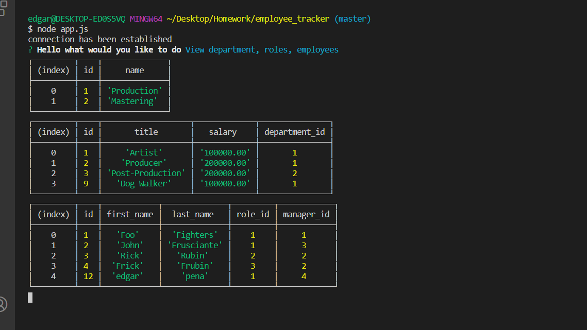

# Employee Tracker

## Description

This is an application ran on Git Bash. It is designed to allow the user to manage employees in a system. The system has tables that include departments,roles,and employees.

## Table of Contents

- [Installation Instructions](#Installation_Instructions)
- [usage Information](#Usage_Information)
- [Questions](#Questions)
- [License](#License)
- [Contributers](#contributers)

## Installation_Instructions

Git Bash => node app.js

## Usage_Information

Open a terminal and type node app.js then you can choose to create, add, delete, or update employee information.

## Questions

GitHub: [edgarpena74](https://github.com/edgarpena74)

Email: edgarpena0740@gmail.com

## License

ISC

## Contributers

Edgar Peña
